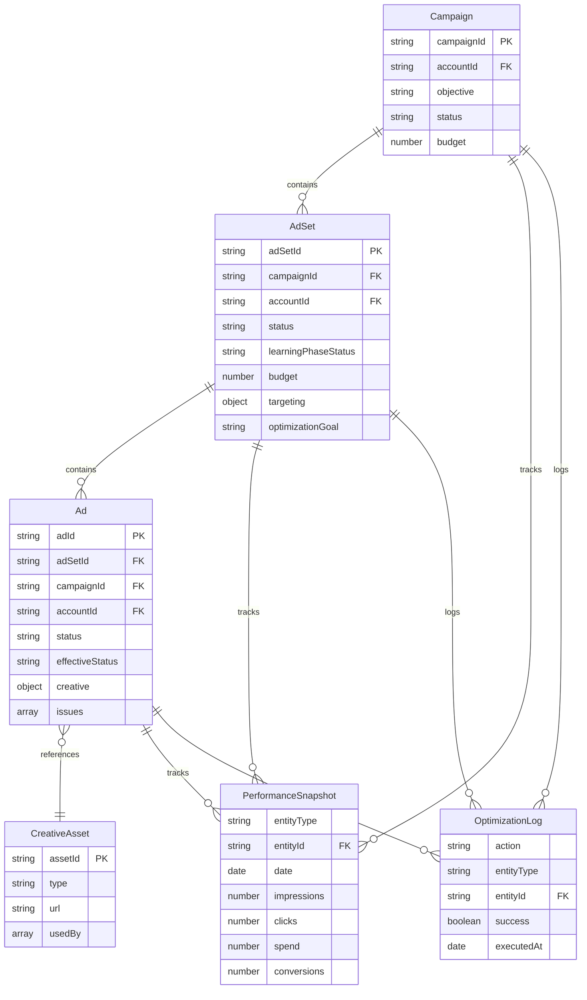

I have created the following plan after thorough exploration and analysis of the codebase. Follow the below plan verbatim. Trust the files and references. Do not re-verify what's written in the plan. Explore only when absolutely necessary. First implement all the proposed file changes and then I'll review all the changes together at the end.

## Key Observations

The codebase follows consistent Mongoose patterns with TypeScript strict typing, explicit indexing, and timestamp tracking. Existing models (`Campaign`, `MetaConnection`, `CreativeAsset`) demonstrate clear conventions: type aliases for enums, Document-extending interfaces, post-schema index definitions, and conditional model exports to prevent recompilation issues. The `PerformanceSnapshot` model already supports `AD_SET` and `AD` entity types, indicating the system was designed to accommodate these models. The optimization strategy document provides detailed field requirements for learning phase tracking and decision-making.

## Approach

Create two new Mongoose models (`AdSet` and `Ad`) following established patterns from `Campaign` and `MetaConnection` models. Include all fields required by the optimization strategy document (learning phase status, optimization events, targeting data, effective status, issues). Add compound indexes for common query patterns (by campaign, by status, by learning phase). Update the database initialization to include these models in the index synchronization process. Export models and types through the central `models/index.ts` barrel file for consistent imports across the codebase.

---

## Implementation Steps

### 1. Create AdSet Model (`file:lib/db/models/ad-set.ts`)

**Type Definitions:**
- Define `AdSetStatus` type: `'ACTIVE' | 'PAUSED' | 'ARCHIVED' | 'DRAFT'`
- Define `LearningPhaseStatus` type: `'LEARNING' | 'ACTIVE' | 'LEARNING_LIMITED' | 'NOT_STARTED'`
- Define `ITargeting` interface with fields:
  - `audienceSize?: number` - total targetable audience
  - `ageMin?: number`, `ageMax?: number`
  - `genders?: number[]` - Meta gender codes
  - `locations?: string[]` - location IDs
  - `interests?: string[]` - interest IDs
  - `customAudiences?: string[]` - custom audience IDs
  - `lookalikes?: string[]` - lookalike audience IDs
  - `exclusions?: Record<string, any>` - excluded audiences

**Interface Definition (`IAdSet`):**
- `adSetId: string` - Meta's ad set ID (unique)
- `campaignId: string` - parent campaign reference
- `accountId: string` - ad account ID for tenant isolation
- `name: string` - ad set name
- `status: AdSetStatus` - current status
- `budget: number` - daily budget in account currency
- `targeting: ITargeting` - audience targeting configuration
- `learningPhaseStatus: LearningPhaseStatus` - learning phase state
- `optimizationGoal: string` - optimization event (e.g., "PURCHASE", "LEAD")
- `deliveryStatus?: string` - Meta's delivery status
- `optimizationEventsCount?: number` - events collected for learning phase
- `ageDays?: number` - days since ad set creation
- `startDate?: Date`, `endDate?: Date` - campaign flight dates
- `createdAt: Date`, `updatedAt: Date` - timestamps

**Schema Definition:**
- Use nested schema for `targeting` field with `{ _id: false }`
- Set `min: 0` validation on `budget` and `optimizationEventsCount`
- Enable timestamps with `{ timestamps: true }`

**Indexes:**
- `{ adSetId: 1 }` with `{ unique: true }`
- `{ campaignId: 1, status: 1 }` - query ad sets by campaign and status
- `{ accountId: 1, status: 1 }` - query by account
- `{ learningPhaseStatus: 1 }` - filter by learning phase
- `{ status: 1, learningPhaseStatus: 1 }` - compound for optimization queries

**Export:**
- Export `AdSetModel` using pattern: `mongoose.models.AdSet || mongoose.model<IAdSet>('AdSet', AdSetSchema)`
- Export types: `IAdSet`, `AdSetStatus`, `LearningPhaseStatus`, `ITargeting`

---

### 2. Create Ad Model (`file:lib/db/models/ad.ts`)

**Type Definitions:**
- Define `AdStatus` type: `'ACTIVE' | 'PAUSED' | 'ARCHIVED' | 'DRAFT'`
- Define `AdEffectiveStatus` type: `'ACTIVE' | 'PAUSED' | 'DISAPPROVED' | 'PENDING_REVIEW' | 'ARCHIVED' | 'DELETED' | 'ADSET_PAUSED' | 'CAMPAIGN_PAUSED'`
- Define `IAdIssue` interface with fields:
  - `errorCode?: string` - Meta error code
  - `errorMessage: string` - human-readable error
  - `errorSummary?: string` - brief summary
  - `level: 'ERROR' | 'WARNING'` - severity level

**Creative Reference:**
- Define `IAdCreative` interface with fields:
  - `creativeId?: string` - reference to `CreativeAsset.assetId`
  - `type?: string` - creative type (IMAGE, VIDEO, etc.)
  - `headline?: string` - ad headline
  - `body?: string` - ad body text
  - `callToAction?: string` - CTA button text
  - `linkUrl?: string` - destination URL
  - `metadata?: Record<string, any>` - additional creative data

**Interface Definition (`IAd`):**
- `adId: string` - Meta's ad ID (unique)
- `adSetId: string` - parent ad set reference
- `campaignId: string` - parent campaign reference (denormalized for queries)
- `accountId: string` - ad account ID for tenant isolation
- `name: string` - ad name
- `status: AdStatus` - user-controlled status
- `creative: IAdCreative` - creative configuration
- `effectiveStatus: AdEffectiveStatus` - Meta's computed status
- `issues?: IAdIssue[]` - policy violations and errors
- `createdAt: Date`, `updatedAt: Date` - timestamps

**Schema Definition:**
- Use nested schema for `creative` field with `{ _id: false }`
- Use nested schema for `issues` array with `{ _id: false }`
- Default `issues` to empty array `[]`
- Enable timestamps with `{ timestamps: true }`

**Indexes:**
- `{ adId: 1 }` with `{ unique: true }`
- `{ adSetId: 1, status: 1 }` - query ads by ad set and status
- `{ campaignId: 1, status: 1 }` - query ads by campaign
- `{ accountId: 1, status: 1 }` - query by account
- `{ effectiveStatus: 1 }` - filter by effective status (e.g., find all DISAPPROVED)
- `{ 'creative.creativeId': 1 }` - find ads using specific creative

**Export:**
- Export `AdModel` using pattern: `mongoose.models.Ad || mongoose.model<IAd>('Ad', AdSchema)`
- Export types: `IAd`, `AdStatus`, `AdEffectiveStatus`, `IAdCreative`, `IAdIssue`

---

### 3. Update Database Initialization (`file:lib/db/index.ts`)

**Add Models to Initialization Array:**
- Import `AdSetModel` from `'./models/ad-set'`
- Import `AdModel` from `'./models/ad'`
- Add both models to the `models` array after line 13:
  ```typescript
  (await import('./models/ad-set')).AdSetModel,
  (await import('./models/ad')).AdModel,
  ```

**Verification:**
- Ensure models are added before the index synchronization loop
- The existing drop/sync logic will handle the new models automatically

---

### 4. Update Model Barrel Export (`file:lib/db/models/index.ts`)

**Add AdSet Exports:**
```typescript
export { AdSetModel } from './ad-set';
export type { IAdSet, AdSetStatus, LearningPhaseStatus, ITargeting } from './ad-set';
```

**Add Ad Exports:**
```typescript
export { AdModel } from './ad';
export type { IAd, AdStatus, AdEffectiveStatus, IAdCreative, IAdIssue } from './ad';
```

**Placement:**
- Add after the `CampaignModel` exports (line 2) to maintain logical grouping (Campaign → AdSet → Ad hierarchy)

---

## Data Model Relationships



---

## Index Strategy Summary

| Model | Index | Purpose |
|-------|-------|---------|
| **AdSet** | `adSetId` (unique) | Primary key lookup |
| **AdSet** | `campaignId + status` | List ad sets by campaign and filter by status |
| **AdSet** | `accountId + status` | Tenant isolation and status filtering |
| **AdSet** | `learningPhaseStatus` | Find all learning/learning-limited ad sets |
| **AdSet** | `status + learningPhaseStatus` | Optimization queries (active + learning) |
| **Ad** | `adId` (unique) | Primary key lookup |
| **Ad** | `adSetId + status` | List ads by ad set and filter by status |
| **Ad** | `campaignId + status` | List ads by campaign (denormalized) |
| **Ad** | `accountId + status` | Tenant isolation and status filtering |
| **Ad** | `effectiveStatus` | Find disapproved/paused ads for emergency handling |
| **Ad** | `creative.creativeId` | Track creative asset usage |

---

## Validation Rules

**AdSet Model:**
- `budget` must be ≥ 0
- `optimizationEventsCount` must be ≥ 0 if provided
- `ageDays` must be ≥ 0 if provided
- `targeting.audienceSize` must be ≥ 0 if provided

**Ad Model:**
- No numeric validations required (status-based only)
- `issues` array defaults to empty if not provided

---

## Testing Considerations

After implementation, verify:
1. Models can be imported via `file:lib/db/models/index.ts`
2. Indexes are created successfully during `initializeDatabase()`
3. Unique constraints work (duplicate `adSetId` or `adId` should fail)
4. Compound indexes support common queries (e.g., find active ad sets in learning phase)
5. Nested schemas serialize/deserialize correctly (targeting, creative, issues)
6. Timestamps are automatically managed by Mongoose
7. Models integrate with existing `PerformanceSnapshot` and `OptimizationLog` models

---

## Migration Path

**For Existing Data:**
- No migration needed (new models, no existing data)
- If Meta API data exists elsewhere, create a migration script following the pattern in `file:scripts/encrypt-existing-tokens.ts`

**For Future Changes:**
- Use Mongoose schema versioning if fields need to be added/removed
- Add migration scripts in `file:scripts/` directory for data transformations